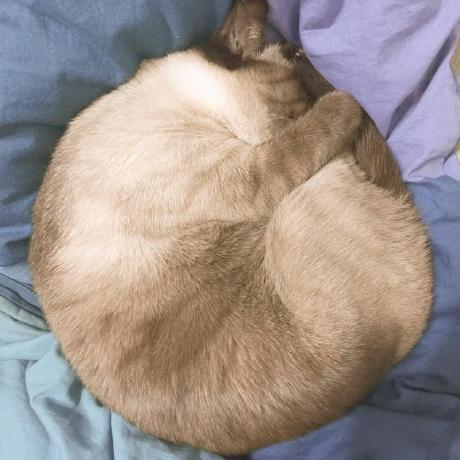

# 🧑‍💻 모던 리액트 딥다이브 스터디

### 🚀 스터디 인트로

- 진행기간: 2024-03-11 ~
- 스터디 장소: 온라인
- 스터디 시간: 월요일 오후 10시

### 👥 Team

<table>
  <tbody>
    <tr>
      <td align="center"><a href="https://github.com/Ssong-Q" target="_blank">
      <br />
      <sub><b>송규경</b></sub></a><br /></td>
      <td align="center"><a href="https://github.com/Eugene-A-01" target="_blank">
      <br />
      <sub><b>안유진</b></sub></a><br /></td>
      <td align="center"><a href="https://github.com/hongjw030" target="_blank">
      <br />
      <sub><b>홍재원</b></sub></a><br /></td>
    </tr>
    <tr>
      <td align="center"><a href="https://github.com/kanglocal" target="_blank">
      <br />
      <sub><b>강현지</b></sub></a><br /></td>
      <td align="center"><a href="https://github.com/summerkimm" target="_blank">
      <br />
      <sub><b>김소은</b></sub></a><br /></td>
    </tr>
  </tbody>
</table>

<br />

### 🏷️ 플랫폼

<table>
  <tbody>
    <tr>
      <td align="center">week 1</td>
      <td align="center">~1.5 이벤트 루프와 비동기 통신의 이해(p.79)</td>
    </tr>
    <tr>
      <td align="center">week 2</td>
      <td align="center"></td>
    </tr>
  </tbody>
</table>

<br/>

### 🧐 스터디 진행 방식

- 분량: 매주 모임에서 그 다음 분량 정하기
- 같은 분량을 1주일 간 읽고 각자의 방식대로 요약 후 `README.md` 로 각자의 폴더에 올리기
- 혹시 읽다가 모르는 부분이 있다면 `Issue`에 올려서 어려운 부분을 공유하고 함께 나누어서 답변이 가능하다면 답변 해주기!
  - `[챕터 / 페이지] 챕터 세부 이름`
  - 예시: `[1.4 클로저 / p.65] 리액트에서의 클로저`
- 스터디 전에 각자 질문 1개씩 준비하기!
  - 스터디에서 준비된 질문으로 Quiz 진행 => 다른 사람의 퀴즈에 대한 실시간 답변
- 다른 스터디원들 비난하지 말기
- commit 후 바로 main branch에 push

<br/>

### ❤ 스터디 규칙

- 모르는 것을 모른다고 하면 아는 사람은 행복해합니다!
  - 적극적으로 모르는 것에 대한 질문을 해주세요.
- 기꺼이 주는 사람이 됩시다!
  - 남을 돕다보면 내가 성공합니다. 내가 다시보려고 남긴 링크가 다른 사람들에게도 큰 공부가 됩니다.
- 서로에게 과도한 열정을 요구하지 않습니다!
  - 서로의 열정의 크기가 같지 않기에 누군가는 그 열정을 힘들어 할 수 있습니다.
- 잡담을 많이 나누는 것이 경쟁력입니다!
  - 무엇보다 내가 아는 것을 상대방에게 말하다보면 내가 얼마나 알고있는지 객관적으로 알 수 있게됩니다. (메타인지)
  - 우리 디코에서 잡담 많이 나눠요~ :)

테오님의 말씀을 인용하였습니다.

### 📝 레포지토리 폴더 규칙

```
{Github Id}/{주차}/{README.md}
```

- 예시: `Ssong-Q/week1/README.md`
- 예시: `폴더/폴더/파일`
  <br/>

### ✅ 커밋 컨벤션

```
{주차}: {해당 주차의 마지막 챕터}
```

- 예시: `week1: 1.5 이벤트 루프와 비동기 통신의 이해`

---
