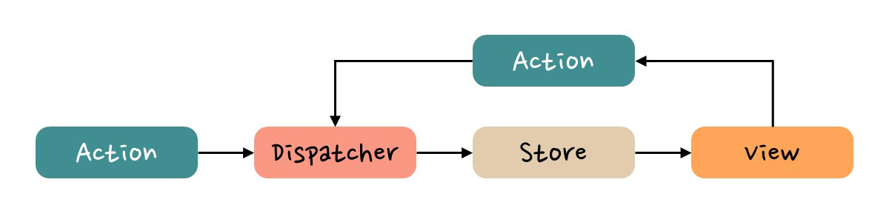

# 모던 리액트 Deep Dive 스터디 week1

## 들어가며

### 리액트의 사용 이유

1. 명시적인 상태 변경
   리액트는 단방향 바인딩만 지원
   - 장점: 단방향 바인딩의 경우, 상태가 변화했다면 그 상태 변화를 명시적으로 일으킨 함수만 찾으면 된다. 데이터 흐름의 변화가 단순하여 코드를 읽기 쉽고, 버그를 야기할 가능성이 비교적 적다.
   - 단점: 단방향 바인딩은 항상 변화를 감지하고 업데이트하는 코드를 매번 작성해야해서, 코드의 규모가 증가하는 단점이 있다.
     > Angular의 경우 양방향 바인딩인데, 양방향으로 바인딩되면 뷰의 변화가 컴포넌트에 영향을 미칠 수도, 반대로 컴포넌트의 상태가 변경되면 뷰의 상태도 변할 수 있다. 양방향 바인딩의 경우 규모가 커질수록 상태의 변화가 무엇으로 인해 일어났는지 파악하기 어려워지는 단점이 있다.

```js
// 리액트의 경우 name이 변경된 이유를 알고 싶다면 setName을 호출하는 곳만 찾으면 됨
function App {
  const [name, setName] = useState('');

  function onChange(e) {
    setName(e.target.value);
  }

  return <input type="text" value={name}>
}
```

2. JSX

- 기존에 알고 있는 자바스크립트 문법에 HTML을 약간 가미한 수준
  > Angular는 뷰를 표현하기 위해 문자열 템플릿을 사용하고 ngIf처럼 Angular에서만 사용되는 전용 문법을 익혀야함

3. 배우기 쉽고 간결함

- 처음 접하기는 쉽다. 즉, 러닝 커브가 낮고 완만. 하지만, 완벽히 이해하고 성능을 최적화하는 것은 상대적으로 어려운 축에 속함

4. 강력한 커뮤니티

### Flux 패턴

2014년 페이스북에서 도입한 새로운 아키텍처
Flux 패턴은 사용자 입력을 기반으로 Action을 생성하고, 이를 Dispatcher에 전달하여 Store의 데이터를 변경한 뒤 View에 반영하는 단방향의 데이터 흐름을 가지는 소프트웨어 아키텍처이다. Flux 패턴으로 구현된 프로젝트는 데이터가 단방향으로만 전달되기 때문에 데이터의 흐름을 파악하기가 용이하고, 그 결과를 쉽게 예측할 수 있다는 장점을 가진다.



이러한 Flux 패턴에 Dan Abramov라는 개발자가 Reducer를 결합하여 만든 것이 바로 리덕스(Redux)이다.

> [출처](https://www.tcpschool.com/react/react_redux_intro#:~:text=Flux%20%ED%8C%A8%ED%84%B4%EC%9D%80%20%EC%82%AC%EC%9A%A9%EC%9E%90%20%EC%9E%85%EB%A0%A5,%EC%9D%84%20%EA%B0%80%EC%A7%80%EB%8A%94%20%EC%86%8C%ED%94%84%ED%8A%B8%EC%9B%A8%EC%96%B4%20%EC%95%84%ED%82%A4%ED%85%8D%EC%B2%98%EC%9E%85%EB%8B%88%EB%8B%A4.)

### 리액트의 다양한 라이브러리

- 상태 관리: Redux, Zustand, Recoil, Jotai
- 서버 사이드 렌더링(SSR): Next.js, Remix, Hydrogen
- 애니메이션: Framer Motion, react-spring, React Move
- 차트: Recharts, visx, nivo
- 폼: React Hook Form, Formik, React Final Form

### 현재 리액트 개발자들 집중적으로 개발하고 있는 것

현재 가장 집중적으로 개발자들이 역량을 쏟고 있는 것은 서버에서의 리액트 활용이다. 서버에서 어떻게 리액트를 효율적으로 사용할 수 있을지에 대해 고민 중이라고 한다. 서버에서 작동할 수 있는 다양한 기능이나 클라이언트에서 할 수 없는 서버에서의 작업을 위주로 개발할 것으로 보인다. 이에 따라 앞으로 리액트를 계속 사용하고 공부할 프론트엔드 개발자들은 Node.js 같은 서버 환경을 공부하는 것이 기본 소양으로 자리 잡을 것 같다.
